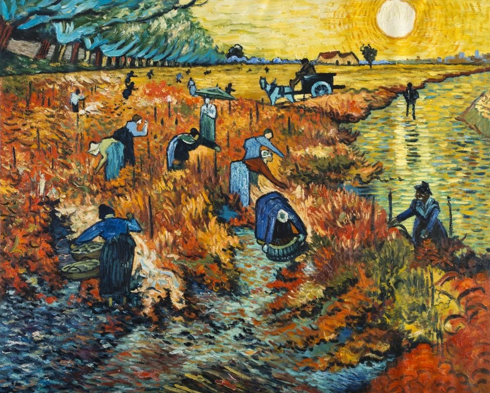

# Neural Style Transfer Telegram Bot

## About
This repository contains my project of Telegram bot capable of [Artistic Style Transfer](https://arxiv.org/abs/1508.06576) in four different styles. The Artistic style transfer is used to mix the content of one image with the style of another. Style transfer model is based on the idea described in [Perceptual Losses for Real-Time Style Transfer and Super-Resolution](https://arxiv.org/abs/1603.08155) and implemented in PyTorch in [this](https://github.com/pytorch/examples/tree/main/fast_neural_style) repository. The model provides fast style transfer that works on CPU and requires minimun amount of computational power. It is wrapped in a Telegram bot that can be easily deployed either locally or on a remote CPU-powered server. The bot is written in Python using [aiogram](https://docs.aiogram.dev/en/latest/) libaraty and asynchronous programming. Hence, it can interract with multiple users at the same time. 

---

## Content

+ [Neural Style Transfer Results](#neural-style-transfer-results)
+ [Bot Functionality](#bot-functionality)
+ [Usage](#usage)
    + [Requirements](#requirements)
    + [Installation](#installation)

----

## Neural Style Transfer Results

As style pictures four painting of van Gogh have been chosen: 

Landscape with a Carriage and a Train        |  Irises        |
|:-------------------------:|:-------------------------:
|   |  | 

Starry Night Over the Rhône       |  The Red Vineyard        |
|:-------------------------:|:-------------------------:
|   |  | 

Neural network has been trained for two full epochs on `82.000` images from [COCO 2014 dataset](https://cocodataset.org/#download) with maually fine-tuned style and content weights. Training logs for all four models can be found in [logs](logs) folder. The experiment has shown that style weight of `5e10` and content weight of `1e5` are the best parameters.

The result of neural style transfer is shown below:

-----


<p align="center">
<b>Transfer of Starry Night Over the Rhône to a Photo of the Shore<b>
</p>

Input Image        |  Stylized Image        |
|:-------------------------:|:-------------------------:
|   |  | 

---

<p align="center">
<b>Transfer of Irises to a Photo of a Tree</b>
</p>

Input Image        |  Stylized Image        |
|:-------------------------:|:-------------------------:
|   |  | 

---

<p align="center">
<b>Transfer of Landscape with a Carriage and a Train to a Photo of a Hill</b>
</p>

Input Image        |  Stylized Image        |
|:-------------------------:|:-------------------------:
|   |  | 

---

<p align="center">
<b>Transfer of The Red Vineyard to a Photo of a Road</b>
</p>

Input Image        |  Stylized Image        |
|:-------------------------:|:-------------------------:
|   |  | 

---

## Bot Functionality

The bot allows to select the style for Neural Style Transfer and upload the photo that should be stylized. The whole process is programmed in an interractive manner with the usage of [Inline Keyboards](https://docs.aiogram.dev/en/latest/telegram/types/inline_keyboard.html) and [CallbackQueries](https://docs.aiogram.dev/en/latest/telegram/types/callback_query.html) that allow easier use of the bot. Photo processing is done completely on CPU and takes `3-5 seconds` depending on the size of the photo. 


---

## Usage

---

### Requirements

The bot is written in Python and uses [aiogram](https://aiogram.dev/) library. The models that do the processing are written in Python using [pytorch](https://pytorch.org/) and [Scipy](https://scipy.org/) libraries. The usage og GPU could speed up the proessing, but the bot is develloped so that it could be used on low-end CPU-powered servers.

The bot was tested on MacBook M1 with macOS Ventura 13.1 installed. The stability on other systems is not promised.

---

### Installation

In order to install the bot first clone this repository to the folder of your choice and procede to the repository

```bash
$ git clone https://github.com/icherniaev/neural_style_transfer_tg_bot
$ cd neural_style_transfer_tg_bot
```

Then, create a virtual environmnet:

```bash
$ python -m venv <name of your virtual environment>
```

Activate your virtual environment:

```bash
$ source <name of your virtual environment>/bin/activate
```

Install necessary packages:

```bash
$ pip install -r requirements.txt
```
Create the file .env in your repository and fill it with your personal telegram [TOKEN](https://core.telegram.org/bots/api) that is achieved from special telegram [bot](https://telegram.me/BotFather). The example of .env file is given in [.env.example](.env.example)

```bash
$ touch .env
$ echo "<your bot token>" .env
```

Finally run [app.py](app.py):

```bash
$ python app.py
```

The bot should start running and you will see logging info in a second.

---

Contact me:

[LinkedIn](https://linkedin.com/in/icherniaev)

[E-mail](mailto:icherniaev@nes.ru)

[Telegram](https://t.me/icherniaev)

